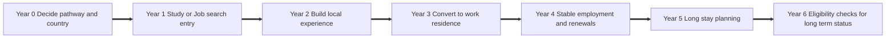
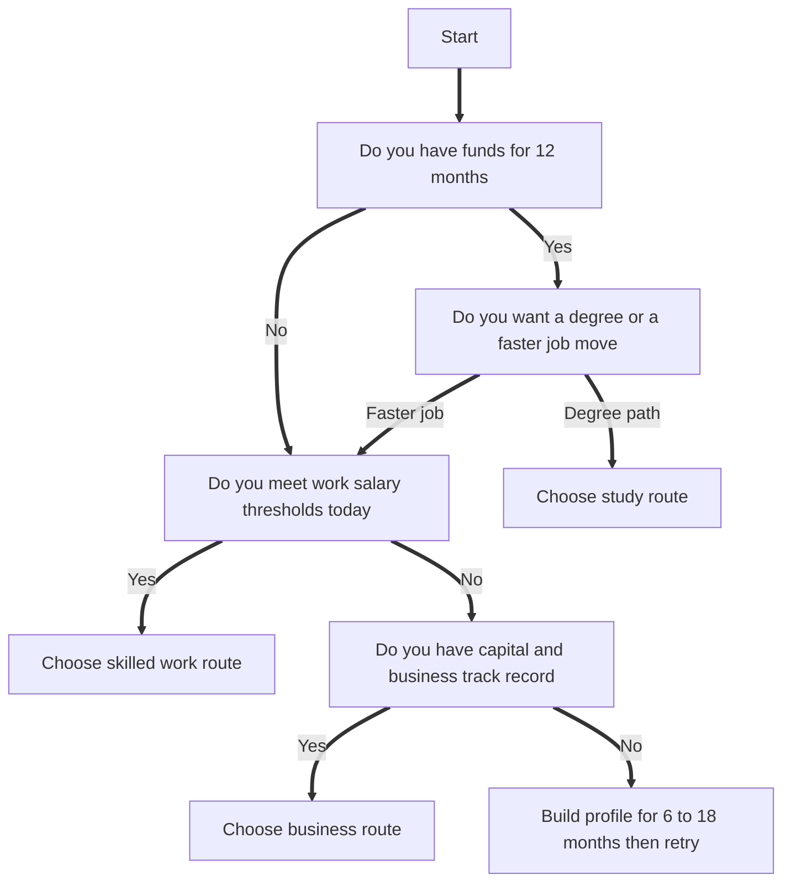

# 3 Legal Pathways to Move to Europe in 2026 Study Work and Business Explained Clearly

## Executive summary

This document is a research based slide briefing for a free online webinar of 90 minutes aimed at students, professionals, and families who want a clear and realistic route to move to Europe through study, skilled work, or business. The core design choice is to keep the webinar high level while still giving legally accurate facts that people can use right away for planning.

The webinar uses three anchor countries for concrete examples and numbers: entity["country","Sweden","country in eu"], entity["country","Germany","country in eu"], and entity["country","Netherlands","country in eu"]. The reason is simple: each represents a different mix of education costs, labour market structure, and permit frameworks, and each has very clear official documentation for study, work, and business routes. citeturn1view0turn10search6turn4search0turn12search1turn17search7turn17search2

The most “load bearing” facts you will use repeatedly during the webinar are these:

Students in Sweden must typically show SEK 10,656 per month for 2026 for a higher education study permit, and accompanying family increases the monthly amount. citeturn1view0

Germany’s standard proof of funds for a study visa is widely communicated as 992 euros per month, which equals 11,904 euros in 2026, and non EU students may work up to 140 full days or 280 half days per year, with an alternative model also described as up to 20 hours per week during term. citeturn2search14turn2search30turn0search9

The Netherlands sets a required study amount for 2026 of 1,130.77 euros per month for university or higher professional education, and student work is limited to 16 hours per week or full time in June, July, and August, with a work permit required. citeturn17search7turn12search2

Post study job search style permits are time limited and usually not extendable: Sweden offers up to 1 year after completing higher education studies, Germany offers up to 18 months after graduating in Germany, and the Netherlands orientation year is 1 year. citeturn3view0turn12search0turn9view0

For the work route, salary thresholds are specific and updated regularly. For example, Germany’s EU Blue Card minimum salary is shown as 50,700 euros for 2026 and 45,934.20 euros for shortage occupations and young professionals, while the Netherlands sets a 2026 monthly gross minimum of 5,942 euros for Highly Skilled Migrants aged 30 and over and 4,357 euros for under 30. citeturn4search0turn17search7

Sweden’s current work permit “good living” minimum is 29,680 SEK per month, based on 80 percent of the median salary at the time of application. The Swedish Government has announced an agreement to move to 90 percent, which would be 33,390 SEK on current figures, with further work on exemptions. This is an important “policy moving” area to handle carefully in wording. citeturn14search2turn14search1

The briefing below provides 30 slides with speaker notes, slide bullets, legal facts, checklists, and citations, plus a country comparison table, three case studies, and two mermaid diagrams you can copy into slides.

## Assumptions and legal boundaries

Assumptions used in this webinar structure:

• The primary audience is non EU citizens. EU and EEA citizens often have very different rights of residence and do not follow the same permit steps. This difference is acknowledged early to avoid confusion. citeturn16search0turn16search2

• The webinar focuses on three anchor countries for numbers. The same pathway logic can apply across the entity["organization","European Union","political economic union"], but exact thresholds and rules differ by country. citeturn16search0turn17search0

• Where rules are in active political change, the webinar states what is current today and separately states what is announced or proposed, with clear dates and citations. An example is Sweden’s announced move toward a higher salary floor for work permits. citeturn14search2turn14search1

Areas to flag as needing professional support, without giving legal advice:

• Business immigration almost always involves tax, company law, and in some cases regulated profession rules. National authorities can assess “economic benefit”, credibility of funds, and genuine business activity, which is fact specific. citeturn6view0turn12search1turn7view0turn8view0

• Family reunification can include integration or language requirements in some countries and can differ across residence types. Requirements should be verified per country and per permit type. citeturn15search7turn15search22

• Cross border mobility, short stays, and the role of the Schengen area are often misunderstood. Schengen is not the same as the EU, and it is not a work authorisation by itself. citeturn16search9turn16search0

## Country comparison and key numbers

### Europe clusters for shortlisting

The webinar uses a clustering method to reduce overwhelm. Instead of “all EU”, attendees shortlist by practical cluster features such as language, labour market style, tuition model, and permit rules. Key baseline context includes the EU having 27 member states. citeturn16search0

image_group{"layout":"carousel","aspect_ratio":"16:9","query":["map of europe regions nordics germany benelux","europe map nordic countries germany netherlands","map of european union member states 2026"],"num_per_query":1}

When you speak about clusters, keep them simple:

• Nordics example Sweden  
• German speaking core example Germany  
• Benelux North Sea corridor example Netherlands  

This style prevents the audience from thinking they must choose from dozens of countries without a method.

### Anchor facts you can cite in the webinar

• EU countries are 27. citeturn16search0  
• EU population is commonly described as about 450 million. Eurostat reports 450.4 million on 1 January 2025 and also projects a peak around 2026 at about 453.3 million. citeturn16search8turn16search1  
• The Schengen area consists of 29 countries, including 25 EU member states and 4 non EU countries. citeturn16search9  
• The EEA includes EU member states plus Iceland, Liechtenstein, and Norway, while Switzerland is not an EEA member. citeturn16search6turn16search2  

### Comparison table Sweden Germany Netherlands

<table>
  <tr>
    <th>Category</th>
    <th>Sweden</th>
    <th>Germany</th>
    <th>Netherlands</th>
  </tr>
  <tr>
    <td>Typical tuition for non EU students</td>
    <td>Commonly described as averaging about 90,000 to 150,000 SEK per year for many programmes, with variation by subject.</td>
    <td>Most public universities do not charge tuition fees, but all students pay a mandatory semester contribution.</td>
    <td>Average institutional tuition is often stated as about 9,000 to 20,000 euros per year for bachelors and 12,000 to 30,000 euros per year for masters.</td>
  </tr>
  <tr>
    <td>Planning baseline for living costs for students</td>
    <td>Residence permit maintenance requirement for 2026 is 10,656 SEK per month for higher education study permits.</td>
    <td>Study visa proof of funds is commonly communicated as 992 euros per month, which equals 11,904 euros in 2026.</td>
    <td>IND required study amount for 2026 is 1,130.77 euros per month for university or higher professional education.</td>
  </tr>
  <tr>
    <td>Student work rules</td>
    <td>Rule setting is not expressed as a fixed hours cap on the key permit page, so the webinar should avoid quoting a specific universal limit and instead stress that studies must remain the main purpose.</td>
    <td>Non EU students may work up to 140 full days or 280 half days per year without approval, with an alternative described as up to 20 hours per week during lectures.</td>
    <td>Students may work only if the employer has a TWV, and the student must choose either up to 16 hours per week or full time in June, July, and August.</td>
  </tr>
  <tr>
    <td>Post study stay option</td>
    <td>Permit to look for work or explore starting a business after completing higher education is up to 1 year and cannot be extended.</td>
    <td>After completing studies in Germany, a residence permit to look for work is up to 18 months and is described as not renewable by the national portal.</td>
    <td>Orientation year residence permit is valid for 1 year and cannot be extended, and allows work freely without a TWV.</td>
  </tr>
  <tr>
    <td>Skilled work main threshold examples</td>
    <td>Work permit “good living” minimum is 29,680 SEK per month. EU Blue Card salary threshold is 52,000 SEK per month as of 9 July 2025.</td>
    <td>EU Blue Card minimum salary is 50,700 euros per year for 2026, and 45,934.20 euros per year for shortage occupations and defined groups such as young professionals.</td>
    <td>2026 salary criteria include Highly Skilled Migrant 5,942 euros per month for age 30 and over, 4,357 euros per month for under 30, and European Blue Card 5,942 euros per month, all as stated by the IND.</td>
  </tr>
  <tr>
    <td>Common business routes</td>
    <td>Residence permit for self employed people requires ownership of at least 51 percent and proof of funds such as 200,000 SEK for the applicant plus family additions.</td>
    <td>Self employment residence permit route under Section 21 is assessed on economic interest or regional need, positive economic impact, and secured financing.</td>
    <td>Start up residence permit requires a facilitator, innovation criteria, and a step by step plan. The self employed permit requires work of essential interest to the Dutch economy.</td>
  </tr>
</table>

Tuition references: Sweden promotional FAQ by Swedish public communication materials and Sweden study portals. citeturn13search9turn13search1  
Germany tuition model reference: entity["organization","DAAD","german academic exchange service"] guidance on semester contributions. citeturn13search2  
Netherlands tuition reference: Study in NL guidance. citeturn13search3  

Living cost baselines and permit rules: Sweden Migration Agency, German official portals, and IND. citeturn1view0turn2search14turn17search7turn0search9turn12search2turn3view0turn12search0turn9view0  

## Slide by slide briefing document

Below are 30 slides designed for a 90 minute webinar. A usable pacing pattern is about 2 to 3 minutes per slide for the earlier slides, then 3 to 5 minutes per slide for the core pathway slides, and 10 to 15 minutes total for Q and A at the end.

### Slide 1

Slide title  
3 Legal Pathways to Move to Europe in 2026 Study Work and Business Explained Clearly

On slide bullets  
• Study pathway  
• Skilled work pathway  
• Business pathway  
• Practical numbers using Sweden, Germany, Netherlands

Speaker notes  
• Welcome everyone and set expectations: clear routes, real numbers, no hype  
• Explain you will show three pathways and how families fit into each  
• Explain that Europe is many systems, so you will use anchor countries for clarity  
• Mention Q and A is at the end

Legal and technical facts  
• EU is a union of 27 member states, but immigration rules are national rules. citeturn16search0  
• Many routes discussed are governed by national laws plus EU directives, such as the EU Blue Card directive. citeturn17search0  

Attendee action items  
• Write down your current status: student, worker, entrepreneur  
• Pick one target start date window: 2026 intake, 2027 intake, or job search in 2026  
• Keep questions in chat for the final Q and A

### Slide 2

Slide title  
What you will get from this webinar

On slide bullets  
• A simple framework to choose a pathway  
• Current planning numbers you can reuse  
• A short list of the permits you must know  
• A checklist for next 30 days

Speaker notes  
• Explain the goal is to help them decide the best entry door for their profile  
• Clarify that processes differ by country, so you will highlight what changes and what stays the same  
• Stress that preparation usually starts 6 to 18 months before moving

Legal and technical facts  
• For study permits and work permits, financial maintenance amounts and salary thresholds are set by national authorities and updated over time. citeturn1view0turn17search7turn14search2  

Attendee action items  
• Choose your top two motivations: education, income, long term residence, business growth  
• Decide who moves first: you alone or family with you  
• Make a simple budget range: low, medium, high

### Slide 3

Slide title  
Important boundaries and how to use this information

On slide bullets  
• High level guidance with official sources  
• Rules differ by nationality and permit type  
• Country rules can change and thresholds update  
• Verify with official pages before applying

Speaker notes  
• Say this session is not a substitute for formal legal advice  
• Explain that you will cite official sources so they can verify  
• Explain you will say “current rule” versus “announced change” when relevant  
• Emphasise that embassies and immigration agencies decide cases, not webinar hosts

Legal and technical facts  
• Sweden’s work permit minimum and Sweden’s announced wage level change are separate items and must be stated with dates. citeturn14search2turn14search1  
• In the Netherlands, many salary and fee amounts are updated annually by the IND. citeturn17search7turn10search1  

Attendee action items  
• Save the key official sites listed at the end of this document  
• Plan to re check thresholds close to your application month  
• If your case involves regulated professions or complex family status, plan a professional review

### Slide 4

Slide title  
Europe is not one system

On slide bullets  
• EU membership is 27 countries  
• Schengen is about border travel, not work rights  
• EEA and Switzerland have special internal market rules  
• Your permit is usually country specific

Speaker notes  
• Explain EU versus Schengen versus EEA using simple examples  
• Correct the common myth: Schengen does not give you the right to work  
• Explain that residence permits are normally issued by one country and do not automatically allow work in another

Legal and technical facts  
• EU has 27 member states. citeturn16search0  
• Schengen area is composed of 29 countries. citeturn16search9  
• EEA includes EU members plus Iceland, Liechtenstein, Norway. citeturn16search6  

Attendee action items  
• Write down your target countries as a top 3, not as “Europe”  
• Check if your target country is in Schengen and whether that changes travel planning only  
• Decide if your priority is English only or you can learn local language

### Slide 5

Slide title  
Cluster method for country shortlisting

On slide bullets  
• Nordics: high living costs, strong systems  
• German speaking core: large labour market, many routes  
• Benelux: international business, high housing pressure  
• Choose 2 to 3 countries only

Speaker notes  
• Explain clustering as a way to reduce overwhelm  
• Give quick examples: Sweden, Germany, Netherlands  
• Mention that job market and housing can matter as much as visas  
• Tell them they will later compare the three anchors in one table

Legal and technical facts  
• Sweden, Germany, Netherlands are all EU member states. citeturn16search0  
• Cross border travel ease via Schengen does not replace residence permits for non EU citizens. citeturn16search9  

Attendee action items  
• Pick one “comfort factor” that matters most: language, cost, jobs, family fit  
• Shortlist 2 countries you can afford for 12 months  
• Pick one backup country

### Slide 6

Slide title  
Baseline planning numbers you can trust

On slide bullets  
• Sweden student funds: 10,656 SEK per month in 2026  
• Germany study funds: 992 euros per month in 2026  
• Netherlands study funds: 1,130.77 euros per month in 2026  
• Always plan extra for housing deposits and setup

Speaker notes  
• Explain these are official minimums used in permit contexts, not luxury budgets  
• Explain what “proof of funds” means in each country at a high level  
• Warn that housing costs can be the biggest uncertainty, especially in the Netherlands

Legal and technical facts  
• Sweden maintenance requirement for higher education study permits in 2026 is 10,656 SEK per month. citeturn1view0  
• Germany proof of funds is communicated as 992 euros per month and 11,904 euros in 2026. citeturn2search14turn2search30  
• Netherlands required study amount for 2026 is 1,130.77 euros per month for university or higher professional education. citeturn17search7  

Attendee action items  
• Multiply the monthly number by 12 to estimate your first year baseline  
• Add a buffer for housing deposit and basic setup  
• Decide if your move requires one income or two incomes for a family plan

### Slide 7

Slide title  
The 3 pathways and who they fit

On slide bullets  
• Study: best when you can invest time and want a structured entry  
• Work: best when you have strong skills and can meet salary floors  
• Business: best when you have capital, experience, and risk tolerance  
• Family members usually join through your main permit

Speaker notes  
• Explain each pathway in one sentence  
• Say families are part of the planning in every pathway  
• Set expectations: business is not a “shortcut” path, it is a complex path

Legal and technical facts  
• National self employment permits can require significant funds and specific evidence, such as Sweden’s proof of funds for self employed people. citeturn6view0  
• Skilled work salary thresholds and EU Blue Card thresholds are set in national rules within EU directive limits. citeturn0search15turn17search0  

Attendee action items  
• Choose one primary pathway and one backup pathway  
• Write down your “weak point” for each path: money, qualification, language, experience  
• Decide a preparation timeline: 6 months, 12 months, 18 months

### Slide 8

Slide title  
Decision lens: Time Money Profile

On slide bullets  
• Time: how fast do you need to move  
• Money: can you fund 12 months without stress  
• Profile: degree, skills, experience, language  
• Family: schooling, spouse work, childcare

Speaker notes  
• Explain this lens will be used in each pathway section  
• If they do not have money for the study route, they must not commit blindly  
• If they do not meet salary thresholds for work route, they need upskilling and time

Legal and technical facts  
• Work permits can require a minimum salary set by national authorities, such as Sweden’s “good living” amount. citeturn14search2  
• Employers may need to be recognised sponsors in some countries, like the Netherlands highly skilled migrant route. citeturn10search6  

Attendee action items  
• Rate yourself 1 to 5 on time, money, profile  
• Write one concrete action for your lowest score  
• If family is moving later, set a realistic sequence

### Slide 9

Slide title  
Pathway 1 Study overview

On slide bullets  
• Choose programme and country  
• Get admission and pay required fees  
• Apply for residence permit or visa  
• Study, build local experience, then transition

Speaker notes  
• Explain study is a structured entry because the sequence is clear  
• Stress that admission is usually the first gate, not the visa  
• Explain that some countries allow post study job search permits, but they are time limited

Legal and technical facts  
• Sweden requires that tuition fee be paid before applying for a residence permit if tuition is required. citeturn1view0  
• Germany allows a post graduation job search residence permit up to 18 months for graduates of German studies. citeturn12search0turn12search12  
• Netherlands offers a 1 year orientation year permit after graduation or research. citeturn9view0  

Attendee action items  
• Pick programme level: bachelors or masters  
• Make a timeline to apply for the next intake  
• Collect a document list now: passport, transcripts, proof of funds, insurance plan

### Slide 10

Slide title  
Study permits Sweden Germany Netherlands key facts

On slide bullets  
• Sweden student permit: 10,656 SEK per month proof in 2026  
• Germany study visa: 992 euros per month proof in 2026  
• Netherlands student permit: 1,130.77 euros per month proof in 2026  
• Each country sets rules for dependants and renewals

Speaker notes  
• Explain the three systems side by side  
• Emphasise that the numbers are minimum legal planning baselines  
• Mention that family finance requirements can increase the needed amount

Legal and technical facts  
• Sweden monthly maintenance and family additions for study permits: spouse 4,440 SEK, child 2,664 SEK. citeturn1view0  
• Netherlands required amounts for study are valid for 2026 and updated by IND. citeturn17search7  
• Germany proof of funds is widely communicated on official German portals. citeturn2search14turn2search30  

Attendee action items  
• Build a 12 month fund plan and list sources: savings, scholarship, loan  
• Decide if family will apply together or later  
• Write 3 alignment questions: why this degree, why this country, what job target after

### Slide 11

Slide title  
Working while studying what is allowed

On slide bullets  
• Germany: up to 140 full days or 280 half days per year  
• Netherlands: up to 16 hours per week or full time in summer months with TWV  
• Sweden: avoid quoting a universal hours cap, focus on study as primary purpose  
• Never assume part time income will cover all costs

Speaker notes  
• Explain that student work is meant to support, not fully fund  
• Warn about unrealistic expectations on housing and job availability  
• Explain that the Netherlands requires employer work permit for student work  
• For Germany, explain the day count and the alternative “hours per week” framing

Legal and technical facts  
• Germany student work allowance: 140 full days or 280 half days per year, with 20 hours per week described as an alternative during term by the official portal. citeturn0search9  
• Netherlands student work rules: choose up to 16 hours per week or full time in June, July, August, and employer needs TWV. citeturn12search2  

Attendee action items  
• Make a budget that works even with zero part time income  
• Plan the first 3 months as “settling time” not “earning time”  
• If you plan to work, list your target job types and required language

### Slide 12

Slide title  
Post study stay options in the 3 anchor countries

On slide bullets  
• Sweden: up to 1 year to look for work or explore starting a business  
• Germany: up to 18 months to look for qualified work after graduation  
• Netherlands: 1 year orientation year, work freely permitted  
• These permits are time limited and usually not extendable

Speaker notes  
• Explain that post study permits are bridges, not permanent solutions  
• Show the key question: can you convert to a work permit in time  
• Stress preparation: internships, projects, language, networking begin during study

Legal and technical facts  
• Sweden post study job search permit: maximum 1 year, cannot be extended, and requires proof of funds for 12 months plus health insurance in some cases. citeturn3view0  
• Germany post study job search: up to 18 months for graduates and you may work during the period. citeturn12search0turn12search12  
• Netherlands orientation year: valid 1 year, cannot be extended, work freely permitted without TWV. citeturn9view0  

Attendee action items  
• Write your target conversion: student to work permit, or student to EU Blue Card  
• List 3 employability steps to do during study  
• Plan an early job search window, not a “last month” rush

### Slide 13

Slide title  
Families and study route what changes

On slide bullets  
• Sweden: family can apply and financial requirement increases  
• Germany and Netherlands: family rules differ by permit type and may add requirements  
• Plan schooling, childcare, and spouse work rights early  
• A realistic plan can be “one moves first”

Speaker notes  
• Explain that “family relocation” is not a separate fourth pathway in this webinar  
• It is a planning layer on top of study, work, or business  
• Use Sweden as a clear numerical example for family funds  
• Remind them to think about healthcare access and insurance

Legal and technical facts  
• Sweden study permit family additions to monthly maintenance in 2026: spouse 4,440 SEK per month and each child 2,664 SEK per month. citeturn1view0  
• Sweden caseworker guidance indicates family members can apply later and must show their own financial maintenance requirements in some cases. citeturn18view0  
• In Germany, the Federal Office for Migration and Refugees states family members coming for family reunification are allowed to work in Germany. citeturn15search22  

Attendee action items  
• If you have children, map childcare and school age needs for the first year  
• Decide if spouse needs work access from day one  
• Create two budgets: single mover and family of three or four

### Slide 14

Slide title  
Study costs quick reality check

On slide bullets  
• Sweden: tuition varies, often stated as about 90,000 to 150,000 SEK per year for many non EU students  
• Germany: tuition often none at public universities, but semester contributions apply  
• Netherlands: typical non EU tuition ranges 9,000 to 20,000 euros bachelors, 12,000 to 30,000 euros masters  
• Living costs are a separate and serious line item

Speaker notes  
• Explain tuition is only one part, living costs and housing matter more  
• Give simple guidance: do not choose country based only on “cheap tuition”  
• Stress reading programme pages and official portals

Legal and technical facts  
• Sweden tuition averages are commonly described as around 90,000 to 150,000 SEK per year for non EU students in government communication materials, with subject variation. citeturn13search9  
• Germany students must pay semester contributions and this is distinct from tuition fees. citeturn13search2  
• Netherlands non EU tuition ranges provided by Study in NL. citeturn13search3  

Attendee action items  
• Get a programme specific tuition quote from official university pages  
• Add your living cost baseline using the official monthly amounts  
• Add one time setup costs: housing deposit, furniture basics, transport cards

### Slide 15

Slide title  
Case study student pathway example timeline and costs

On slide bullets  
• Example: masters in Sweden, then 1 year job search permit  
• Year 1 study and local projects  
• Year 2 job search and conversion to work permit  
• Budget uses official minimum funds plus tuition estimate

Speaker notes  
• Explain this is a planning example, not a promise  
• Show how the legal numbers translate into a real budget  
• Explain the key success factor is employability built during the degree

Legal and technical facts  
• Sweden study permit maintenance requirement in 2026: 10,656 SEK per month. citeturn1view0  
• Sweden post study permit to look for work: up to 1 year, cannot be extended. citeturn3view0  
• Sweden work permit “good living” current minimum: 29,680 SEK per month. citeturn14search2  

Attendee action items  
• Write your own version of this timeline for your target country  
• Identify the conversion point and what proof you need  
• Set a goal: one internship or project per term

Planning example numbers for the case study  
Assume a 12 month masters programme with 12 months living funds proof.

• Living funds proof baseline: 10,656 SEK × 12 = 127,872 SEK citeturn1view0  
• Tuition: use your programme specific fee, with a rough planning range often described as about 90,000 to 150,000 SEK per year for many programmes citeturn13search9  
• Total baseline planning range for year 1: about 218,000 to 278,000 SEK plus travel and setup costs  
This is a planning estimate. Actual tuition and housing can vary strongly by city and programme.

### Slide 16

Slide title  
Pathway 2 Skilled work overview

On slide bullets  
• You usually need a job offer that meets national rules  
• Salary floors matter  
• Employer compliance matters  
• Family planning is often easier than under study

Speaker notes  
• Explain the “work route” is not one permit, it is a bundle of permits  
• Explain that some permits are national, and some are EU scheme permits such as EU Blue Card  
• Stress that the employer often files key steps, especially in the Netherlands

Legal and technical facts  
• Sweden requires salary and conditions in line with collective agreements or common practice, and a minimum salary floor for a work permit. citeturn14search0turn14search2  
• Netherlands highly skilled migrant route requires an employer recognised by the IND to apply. citeturn10search6  

Attendee action items  
• Check if your job fits “highly qualified” versus “skilled worker” definitions in your target country  
• Set a realistic job search plan: portfolio, CV format, references  
• Decide if you will target EU Blue Card eligibility or national work permit first

### Slide 17

Slide title  
Work permit types you will hear about

On slide bullets  
• EU Blue Card for highly qualified employment  
• National work permits for skilled employment  
• Job search permits and opportunity style permits  
• Intra company transfer permits exist but not a focus today

Speaker notes  
• Explain the difference using simple language: Blue Card is a specific brand of permit, not the only permit  
• Explain job search permits can be time limited and may restrict work  
• Mention that job search permits do not replace the need to qualify for a work permit later

Legal and technical facts  
• EU Blue Card rules are set by Directive (EU) 2021/1883. citeturn17search0turn0search15  
• Germany Opportunity Card can allow job search for up to 1 year and allows up to 20 hours per week of secondary work. citeturn10search4turn10search32  

Attendee action items  
• Write the permit you think you qualify for today  
• Write the permit you want to qualify for in 12 months  
• List the one gap you must close: salary level, experience, degree recognition, language

### Slide 18

Slide title  
EU Blue Card concept and EU level rules

On slide bullets  
• Salary thresholds are set nationally within EU rules  
• Contract or job offer must meet a minimum duration in many systems  
• Designed for highly qualified employment  
• Mobility between EU participating countries is a core idea

Speaker notes  
• Explain EU Blue Card is meant for highly qualified workers from outside EU  
• Explain every country can set its own salary threshold within the EU permitted range  
• Explain this is why “same job title” can qualify in one country and not in another

Legal and technical facts  
• European Commission guidance states salary thresholds are between 1 and 1.6 times the national average gross annual salary, with possible lower threshold options in certain cases. citeturn0search15turn0search3  
• Directive (EU) 2021/1883 is the core legal text. citeturn17search0  

Attendee action items  
• If you target EU Blue Card, list your likely salary offer range  
• Check the target country’s current Blue Card threshold  
• Confirm your qualification or recognised experience matches the job

### Slide 19

Slide title  
Work route snapshot Sweden Germany Netherlands

On slide bullets  
• Sweden work permit minimum now: 29,680 SEK per month  
• Sweden announced target: 90 percent of median, stated as 33,390 SEK on current figures  
• Germany EU Blue Card 2026: 50,700 euros per year standard  
• Netherlands 2026 HSM monthly minimum: 5,942 euros for age 30 and over

Speaker notes  
• Start with Sweden because many attendees may have heard about changes  
• Clearly separate current rule versus announced change  
• Emphasise that salaries are only one condition, employer compliance and role fit matter too

Legal and technical facts  
• Sweden “good living” minimum is 29,680 SEK per month and is based on 80 percent of median salary at time of application. citeturn14search2turn14search0  
• Sweden Government press release describes an agreement to adjust labour immigration wage level to 90 percent, with the example 33,390 SEK. citeturn14search1  
• Germany EU Blue Card salary thresholds for 2026: 50,700 euros standard and 45,934.20 euros for shortage occupations and certain groups, per the national portal. citeturn4search0  
• Netherlands 2026 salary criteria for highly skilled migrants and EU Blue Card are published by the IND. citeturn10search1  

Attendee action items  
• If you are near a salary threshold, choose a pathway that gives margin  
• Ask employers for a gross salary breakdown, not net estimates  
• Plan for annual threshold updates in long hiring cycles

### Slide 20

Slide title  
Sweden work permits and EU Blue Card key points

On slide bullets  
• Work permit: salary must meet 29,680 SEK minimum and match collective agreements  
• Employer must arrange required insurance  
• EU Blue Card: salary threshold 52,000 SEK per month as of 9 July 2025  
• EU Blue Card contract minimum reduced to 6 months under new rules

Speaker notes  
• Explain Sweden has a standard work permit route and an EU Blue Card route  
• Explain the insurance requirement is a common reason for problems  
• Mention that EU Blue Card applicants are not subject to the “good living” requirement in the same way, per Migration Agency guidance

Legal and technical facts  
• Sweden work permit salary floor and insurance requirements are described by the Swedish Migration Agency. citeturn14search0turn14search2  
• Sweden EU Blue Card salary threshold is 52,000 SEK per month since 9 July 2025, and the threshold corresponds to 1.25 times average gross salary. citeturn17search2turn17search10  
• Sweden Migration Agency news states Blue Card changes including reduced contract period requirement to 6 months. citeturn17search18  

Attendee action items  
• Ask your employer to confirm insurance coverage before start date  
• If you are targeting Blue Card, confirm salary meets the Blue Card threshold, not the work permit minimum  
• For families, plan spouse job search early because it changes budget pressure

### Slide 21

Slide title  
Germany skilled work EU Blue Card and Opportunity Card

On slide bullets  
• EU Blue Card 2026: 50,700 euros standard threshold  
• EU Blue Card is usually issued up to 4 years, or contract plus 3 months  
• After German graduation: up to 18 months job search permit  
• Opportunity Card: up to 1 year job search, up to 20 hours per week allowed

Speaker notes  
• Explain Germany offers multiple entry points, but each has clear rules  
• Emphasise that the EU Blue Card has defined salary thresholds for 2026  
• Explain Opportunity Card is for job search in Germany and still needs conversion to a work residence title

Legal and technical facts  
• Germany EU Blue Card salary thresholds for 2026 shown on the official portal. citeturn4search0  
• BAMF states EU Blue Card is issued for four years as a rule, or contract duration plus three months, and contract at least six months is required. citeturn4search21  
• Germany post graduation job search permit: up to 18 months, and you may work during this time, per official sources. citeturn12search0turn12search12  
• Opportunity Card allows up to 20 hours per week and is usually issued for one year, per German public service and national portal. citeturn10search4turn10search32  

Attendee action items  
• Choose your target: is it Blue Card eligibility or a standard skilled work permit  
• If you want the Opportunity Card, check the points and funding requirements on official resources  
• If you are a student, plan your post graduation job search timeline early

### Slide 22

Slide title  
Netherlands work routes Highly Skilled Migrant and EU Blue Card

On slide bullets  
• Highly Skilled Migrant: employer must be recognised sponsor  
• EU Blue Card: recognised sponsor not required  
• 2026 salary thresholds published by IND  
• Orientation year gives work freedom for 1 year after graduation

Speaker notes  
• Explain the Netherlands is very employer driven for the standard skilled route  
• Explain Blue Card is an alternative with different sponsor rules  
• Mention housing pressure is high, so planning time matters

Legal and technical facts  
• Highly Skilled Migrant requires an employer recognised by IND to apply. citeturn10search6  
• IND sets 2026 gross monthly minimums such as 5,942 euros for HSM age 30 and over and 4,357 euros for under 30, plus Blue Card thresholds. citeturn10search1  
• IND Blue Card page states employer does not need to be recognised sponsor for European Blue Card in the Netherlands and contract must be at least 6 months. citeturn11view0  
• Orientation year allows work freely permitted without TWV and is valid for 1 year, not extendable. citeturn9view0  

Attendee action items  
• Ask if your target employers are recognised sponsors  
• Target the orientation year if you are graduating and want a bridge year  
• Use the IND published salary amounts as a non negotiable planning baseline

### Slide 23

Slide title  
Families under the work route what to expect

On slide bullets  
• Sweden: partners with accompanying family permits can work  
• Germany: family reunification allows family members to work  
• Netherlands: family of self employed and some work routes can work without separate TWV  
• Plan proof of housing and income needs

Speaker notes  
• Explain family joining tends to be more predictable under work than under study, but still needs planning  
• Give one clear message: always check the work rights written on the residence card  
• Mention children’s schooling and spouse labour market integration

Legal and technical facts  
• Sweden government information site states partners who receive a residence permit as accompanying family have the right to work in Sweden. citeturn15search32  
• BAMF states family members coming to Germany for family reunification are allowed to work in Germany. citeturn15search22  
• IND self employed permit page states family members are allowed to work without TWV and the residence card will show it. citeturn7view0  

Attendee action items  
• Build a family relocation plan with two stages if needed  
• Check education options and childcare costs early  
• Plan language learning for spouse as a career multiplier

### Slide 24

Slide title  
Case study skilled worker pathway example timeline and costs

On slide bullets  
• Example: Netherlands route via orientation year then HSM  
• Year 0 study and internship  
• Year 1 orientation year and job conversion  
• Budget uses official living amount baseline and salary thresholds

Speaker notes  
• Explain the Netherlands is a good example of structured conversion using orientation year  
• Show the need to meet salary thresholds at the job offer stage  
• Explain that the employer being a recognised sponsor is a gate for HSM

Legal and technical facts  
• Netherlands orientation year is valid for 1 year and cannot be extended, and allows work freely. citeturn9view0  
• Netherlands HSM salary thresholds for 2026 are set by IND and are mandatory. citeturn10search1  
• Netherlands study required amount for 2026 is 1,130.77 euros per month. citeturn17search7  

Attendee action items  
• Map your conversion path: orientation year to HSM or Blue Card  
• Confirm your target role salary meets the threshold on the contract  
• Confirm employer sponsor status for HSM

Planning example numbers for the case study  
Assume 12 months study living amount planning plus 12 months orientation year living planning.

• Required study amount baseline: 1,130.77 euros × 12 = 13,569.24 euros for 2026 planning citeturn17search7  
• Orientation year fee: 254 euros citeturn9view0  
• HSM salary floor example: 5,942 euros per month for age 30 and over, or 4,357 euros per month for under 30 citeturn10search1  
These are planning baselines. Actual tuition and rent can vary strongly.

### Slide 25

Slide title  
Pathway 3 Business overview

On slide bullets  
• Business route is real, but complex  
• Common routes: self employed permits and start up permits  
• You must show credibility, funds, and real activity  
• Not a shortcut path

Speaker notes  
• Explain business route is best for people with experience and capital  
• Explain that countries test “genuine business” and “economic value” differently  
• Explain you will focus on official high level requirements only

Legal and technical facts  
• Sweden self employed permit requires majority ownership and proof of substantial funds. citeturn6view0  
• Germany has a self employment residence permit route grounded in Section 21 criteria, described on official portals. citeturn12search1turn12search25  
• Netherlands has a start up permit for 1 year and then self employed route, with innovation and facilitator requirements. citeturn8view0turn7view0  

Attendee action items  
• Write your business type: service, product, tech, consulting  
• List your proof: revenue history, clients, funds, qualifications  
• Decide if you want to start while abroad or after an initial job or study route

### Slide 26

Slide title  
Sweden business route self employed people

On slide bullets  
• Must own at least 51 percent and run the business  
• Must show industry experience and Swedish or English knowledge  
• Funds: at least 200,000 SEK for you, plus 100,000 SEK spouse, 50,000 SEK per child  
• Loans not normally accepted for the “support yourself” part

Speaker notes  
• Explain Sweden self employed is a serious route with strict proof  
• Explain language expectations depend on customer and supplier needs  
• Explain they will assess business plan credibility and networks

Legal and technical facts  
• Sweden self employed permit requires ownership of at least 51 percent and running the business. citeturn6view0  
• Sweden funds requirement for self support includes 200,000 SEK for applicant plus family additions. citeturn6view0  

Attendee action items  
• Prepare a simple business plan and a credible budget  
• Document customer contacts, contracts, or letters of intent  
• Build a personal and business funds trace you can evidence

### Slide 27

Slide title  
Germany business route self employment visa

On slide bullets  
• Economic interest or regional demand  
• Positive impact on the economy expected  
• Financing secured by capital or loan commitment  
• Extra condition if over age 45: adequate pension provision

Speaker notes  
• Explain Germany assesses business impact, not just registration  
• Explain the evidence burden is high: plan, financing, market, permits  
• Explain freelancers can also fall under the same basic route logic

Legal and technical facts  
• Official German portal lists the core requirements: economic interest or regional demand, positive economic effect, and secured financing, plus pension provision rule for over 45. citeturn12search1  
• German Federal Foreign Office FAQ repeats the same core criteria for self employment permits. citeturn12search25  

Attendee action items  
• Identify the German region and explain local demand  
• Prepare proof of financing and why it is stable  
• Consider whether your activity is “freelance” or “commercial” in German terms and plan evidence accordingly

### Slide 28

Slide title  
Netherlands business route start up then self employed

On slide bullets  
• Start up permit: 1 year to launch an innovative business  
• Must work with a facilitator and sign an agreement  
• Must meet innovation criteria and have a step by step plan  
• After 1 year: move to self employed permit if requirements met

Speaker notes  
• Explain Netherlands start up route is structured and mentor based  
• Explain innovation is a central requirement  
• Explain the “switch” to self employed route is not automatic, it is a new assessment

Legal and technical facts  
• IND start up permit: maximum validity 1 year, not extendable, can switch after 1 year to self employed with facilitator declaration. citeturn8view0  
• IND self employed permit requires work of essential interest to the Dutch economy and registration in Chamber of Commerce. citeturn7view0  
• Business.gov.nl summary also states the start up residence permit gives 1 year and requires a facilitator. citeturn4search2  

Attendee action items  
• Find a potential facilitator and understand their expectations  
• Draft a step by step plan and define innovation clearly  
• Plan how you will support yourself financially during the first year

### Slide 29

Slide title  
Business checklist and risks families must know

On slide bullets  
• Proof pack: plan, funds, contracts, background, registrations  
• Taxes, accounting, and compliance are not optional  
• Family planning: schooling and spouse work access  
• Business route has higher uncertainty than study or work

Speaker notes  
• Explain the best business plan for immigration is a real business plan  
• Explain there is often a requirement to show personal funds plus business funds  
• Explain families should plan stability first, then growth

Legal and technical facts  
• Sweden requires funds for self support plus evidence of funds to run the business, and assesses plans. citeturn6view0  
• Netherlands self employed permit may come with work status notes on the residence card, and family can work without TWV. citeturn7view0  

Attendee action items  
• Create a one page “proof pack checklist” and start collecting evidence now  
• Consult a tax and company professional in the target country before committing large funds  
• Decide if a study or work entry followed by business later is safer for your family

### Slide 30

Slide title  
Wrap up your 30 day action plan and Q and A

On slide bullets  
• Step 1 choose one pathway and one backup  
• Step 2 shortlist 2 to 3 countries  
• Step 3 build a budget using official baselines  
• Step 4 make a document plan  
• Q and A

Speaker notes  
• Summarise the webinar in one minute: choose a route, shortlist, budget, prepare  
• Remind them not to plan on “best case”, plan on “normal case”  
• Invite questions and keep answers short and source based  
• If you offer follow up support, mention it briefly and clearly

Legal and technical facts  
• Official baselines used in this webinar include Sweden 10,656 SEK per month for student permits in 2026, Germany 992 euros per month proof of funds for study in 2026, and Netherlands 1,130.77 euros per month for study in 2026. citeturn1view0turn2search14turn17search7  

Attendee action items  
• In the next 7 days, shortlist 10 programmes or 20 target employers  
• In the next 14 days, collect documents and start language planning  
• In the next 30 days, decide the pathway and commit to a timeline

## Visual aids to copy into slides

### Six year pathway timeline flowchart

Use this as a simple “one slide story” of how pathways often connect. The labels are generic so it can apply to Sweden, Germany, or the Netherlands. The legal basis is that post study permits and job search permits are time limited bridges, not permanent residence by themselves. citeturn3view0turn12search0turn9view0

### Decision framework flowchart

This is designed to be used at the start and again at the end.

## Prioritised sources

Primary EU level sources

• entity["organization","European Commission","eu executive body"] guidance on EU Blue Card and main rule changes. citeturn0search15  
• Directive (EU) 2021/1883 full legal text entry reference. citeturn17search0  
• EU membership facts and figures and EU country list. citeturn16search0turn16search19  
• entity["organization","Eurostat","eu statistics office"] EU population statistics and projection context. citeturn16search8turn16search1  

Sweden official sources

• entity["organization","Swedish Migration Agency","immigration agency sweden"] higher education study permit rules and 2026 maintenance requirement amounts. citeturn1view0  
• Swedish Migration Agency post study permit to look for work after completing studies. citeturn3view0  
• Swedish Migration Agency work permit requirements and current “good living” threshold. citeturn14search0turn14search2  
• Swedish Migration Agency EU Blue Card threshold and rule changes. citeturn17search2turn17search18  
• entity["organization","Government of Sweden","national government sweden"] press release on announced wage level change for labour immigration. citeturn14search1  
• entity["organization","Statistics Sweden","national stats agency sweden"] referenced in Migration Agency explanation of median salary based thresholds. citeturn14search2  
• entity["organization","Swedish National Mediation Office","wage stats agency sweden"] referenced for Blue Card threshold calculation basis. citeturn17search2  

Germany official sources

• entity["organization","Make it in Germany","german govt info portal"] EU Blue Card thresholds for 2026 and post graduation prospects. citeturn4search0turn12search0  
• entity["organization","Federal Foreign Office","german foreign ministry"] study visa proof of funds and self employment FAQ. citeturn2search14turn12search25  
• entity["organization","Federal Office for Migration and Refugees","german migration agency"] post study job search and Blue Card issuance basics. citeturn12search12turn4search21  
• Germany Opportunity Card official public sources. citeturn10search32turn10search4  
• entity["organization","DAAD","german academic exchange service"] cost and semester contribution overview. citeturn13search2  

Netherlands official sources

• entity["organization","Immigration and Naturalisation Service","nl immigration service"] study required amounts for 2026, salary thresholds for 2026, HSM rules, Blue Card rules, and orientation year rules. citeturn17search7turn10search1turn10search6turn11view0turn9view0  
• entity["organization","Government of the Netherlands","national government netherlands"] work permit context and general guidance. citeturn12search14turn16search18  
• Netherlands student work rules via IND student permit page and EU immigration portal summaries. citeturn12search2turn12search6  
• Netherlands start up permit and facilitator logic via IND and business.gov.nl, including 1 year validity and conditions. citeturn8view0turn4search2  
• entity["organization","Netherlands Enterprise Agency","nl enterprise agency"] facilitator role and lists referenced by IND. citeturn4search13turn8view0